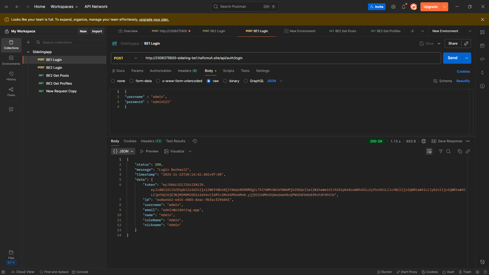
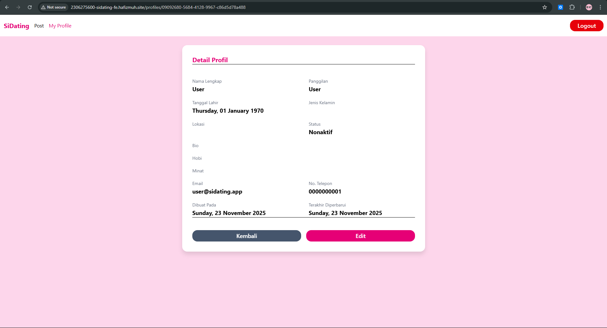
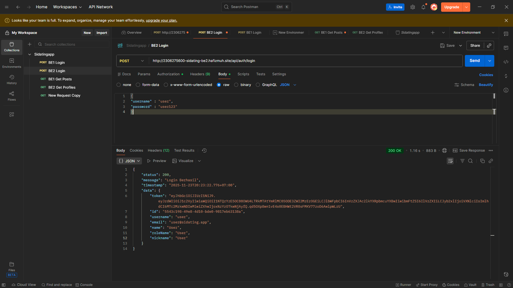
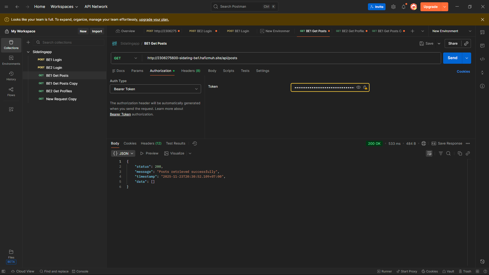
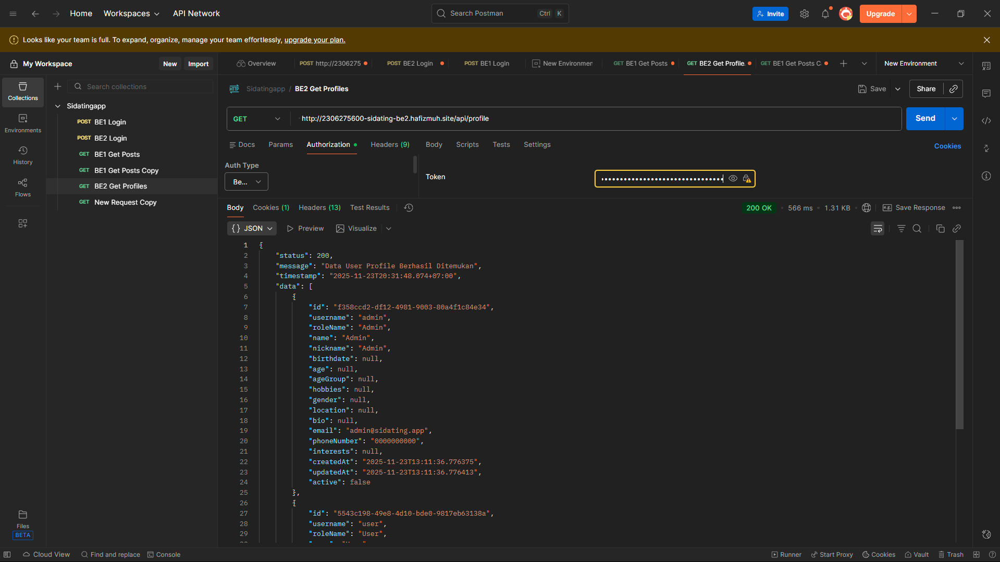
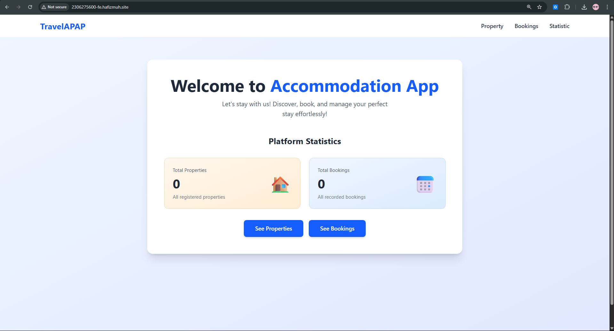
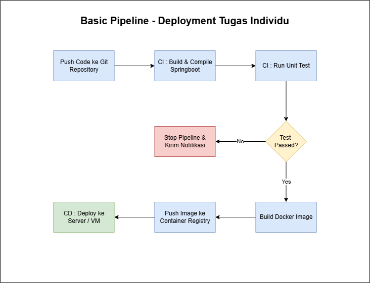

# TI APAP - Accommodation - 2306275600

## P09
### 1. Bukti screenshot deployment Sidating BE1, BE2 dan FE, serta BE dan FE Tugas Individu.
Sidating App

Tugas Individu Accommodation

### 2. Buatlah gambar pipeline CI/CD kalian sendiri, sesuai dengan yang kalian lakukan pada deployment Tugas Individunya (buatkan untuk Spring Boot saja), dan berikan deskripsi singkatnya !

**Basic Pipeline – Deployment Tugas Individu**

1. Push Code ke Git Repository : Developer push kode ke GitLab.

2. CI: Build & Compile Spring Boot :

     Pipeline otomatis jalan dan kode di-build dan di-compile jadi aplikasi Spring Boot.

3. CI: Run Unit Test
    
    Setelah build, dijalankan unit test untuk memastikan fungsi dasar kode tidak rusak.

4. Decision: “Test Passed?”

    - Kalau gagal (No) → Pipeline berhenti di sini dan ada langkah “Stop Pipeline & Kirim Notifikasi” ke developer.

    - Kalau lulus (Yes) → lanjut ke tahap berikutnya.

5. Build Docker Image
    
    Aplikasi yang sudah lulus test dikemas jadi Docker image.

6. Push Image ke Container Registry

    Docker image dikirim ke registry (misalnya Docker Hub, GitLab Registry, ECR, dsb).

7. CD: Deploy ke Server / VM

    Dari registry, image tersebut dipakai untuk deploy ke server/VM. Aplikasi siap dipakai user.

### 3. Buatlah gambar pipeline CI/CD Improvement, yang menggambarkan pipeline yang lebih complete dan terstruktur dibandingkan pipeline yang sekarang kalian terapkan (jika kalian bisa melakukan perbaikan apa yang akan kalian tambahkan/perbaiki dari pipeline yang telah digunakan sebelumnya), berikan juga penjelasan singkat terkait improvement yang kalian lakukan!

### 4. Pada EC2 instance yang kalian gunakan, kalian diperintahkan untuk mengaitkan dengan Elastic IP. Mengapa demikian ? Lalu apa yang terjadi jika kalian tidak mengaitkan instance dengan Elastic IP ?
Alokasi elastic IP adalah agar IP tersebut tidak digunakan oleh orang lain dan hanya berlaku untuk kita. Saat kita mengaitkan instance dengan elastic IP yang kita punya, instance tersebut jadi dapat diakses menggunakan public IP yang statis (tidak berubah setiap environment restart). Jika kita tidak mengaitkan instance dengan elastic IP, instance kita tidak akan memiliki public IP yang pasti dan akan berubah setiap kita start lab AWS dan membuat domain yang sudah dimapping salah menunjuk IP yang sesuai.
### 5. Apa perbedaan utama dari penggunaan Docker dan Kubernetes pada praktikum ini ?
1. Push Code / Pull Request

    Pipeline mulai saat ada push atau PR.

2. Static Code Analysis (SonarLint/SonarQube)

    Kode dianalisis secara statis: cek code smell, bug potensial, duplikasi, coverage, dsb.

3. Security Scan (Snyk/Trivy Dependencies)

    Dependency dicek apakah ada vulnerability (celah keamanan) yang sudah diketahui.

3. Build & Compile Spring Boot Application

    Kalau analisis dan scan aman, baru aplikasi di-build dan di-compile.

5. Run Unit Tests (JUnit/Mockito)

    Menjalankan unit test seperti biasa.

6. Run Integration Tests (Database & API Tests)

    Tambahan: dites juga integrasi ke database dan API lain, bukan hanya fungsi kecil per method.

7. Decision: “Semua Test Lulus?”

    - Kalau ya (Ya) → lanjut.
    - Kalau tidak (Tidak) → Stop Pipeline + Notifikasi Developer.

8. Build Docker Image (Multi-stage Build)

    Build Docker image dengan teknik multi-stage (biasanya lebih kecil dan efisien).

9. Scan Docker Image – Security Vulnerabilities

    Image yang sudah dibuat di-scan lagi untuk cek kerentanan di level image (OS, library, dsb).

10. Push Image to Container Registry (Docker Hub/ECR)

    Image yang aman dipush ke registry.

11. Deploy to Staging Environment (Kubernetes/Docker)

    Image tidak langsung ke production, tapi deploy dulu ke staging (lingkungan mirip production, tapi untuk testing).

12. Automated Smoke Test (Health Check & API Test)

    Di staging dijalankan smoke test otomatis:
    - Cek service hidup/tidak (health check).
    - Cek beberapa endpoint API penting.

13. Decision: “Smoke Test OK?”

    - Kalau OK (Ya) → boleh lanjut.
    - Kalau tidak OK (Tidak) → Stop + Notifikasi, Rollback Available (bisa balik ke versi sebelumnya).

14. Manual Approval (Optional Gate)
    Ada gate manual: misalnya lead/devops harus klik “Approve” dulu sebelum ke production.

15. Deploy to Production (Blue-Green / Canary)

    Deployment ke production menggunakan strategi aman:

    - Blue-Green: dua environment (lama & baru), pindah trafik setelah yakin.
    - Canary: rilis ke sebagian kecil user dulu.

16. Monitoring & Logging (Prometheus/Grafana/ELK)
    
    Setelah live, aplikasi dimonitor dan di-log. Bila terdeteksi error serius, ada opsi auto rollback ke versi sebelumnya.

### 6. Dari keseluruhan pipeline yang dibuat, menurutmu proses mana yang paling penting dan mengapa ?
Menurut saya, bagian paling krusial dalam pipeline CI/CD adalah tahap deployment. Pada fase ini, image yang sudah berhasil dibuat benar-benar dijalankan di EC2 melalui Kubernetes dan dihubungkan dengan Secret, ConfigMap, Service, serta Ingress. Sedikit saja ada kesalahan pada tahap ini—misalnya environment variable yang keliru atau konfigurasi domain yang salah di source code—aplikasi bisa langsung tidak dapat diakses dengan semestinya, walaupun proses build dan docker push sudah berhasil. Karena itu, tahap deployment memiliki dampak terbesar terhadap apakah aplikasi benar-benar bisa digunakan melalui URL deployment-nya.

### 7. Pada konfigurasi kubernetes, sebenarnya kalian menggunakan 5 file konfigurasi 3 pada repository folder k8s dan 2 (secret.yaml & config.yaml) dibuat pada .gitlab-ci.yml. Buatkan penjelasan kegunaan dari kelima file tersebut !
* `deployment.yaml`
Digunakan untuk mendefinisikan cara sebuah container dijalankan di Kubernetes, misalnya image Docker yang dipakai, jumlah replica, port container, serta environment variable yang diambil dari ConfigMap dan Secret. Berdasarkan file ini, Kubernetes akan membuat objek Deployment yang mengatur lifecycle pod.

* `service.yaml`
Dipakai untuk membuat objek Service yang memberikan alamat tetap (static address) di dalam cluster untuk pod backend. Meskipun nama pod bisa berubah saat restart atau rolling update, Service tetap memiliki nama dan port yang konsisten sebagai titik akses.

* `ingress.yaml`
Berfungsi mengatur aliran traffic dari internet ke Service di dalam cluster. Di file ini kita mendefinisikan host/domain (misalnya: 2306275600-be.hafizmuh.site) dan rule path yang akan meneruskan request ke accommodation-be-service (yang didefinisikan di `service.yaml`).

* `secret.yaml`
Digunakan untuk menyimpan konfigurasi sensitif, seperti `DATABASE_PASSWORD` dan `CORS_ALLOWED_ORIGINS`. Nilai-nilai tersebut disimpan sebagai objek Secret Kubernetes dan kemudian diinject ke pod sebagai environment variable.

* `config.yaml`
Digunakan untuk menyimpan konfigurasi non-sensitif, seperti `DATABASE_URL_PROD` dan `DATABASE_USERNAME`. Nilainya akan diinject ke pod sebagai environment variable sehingga aplikasi dapat membacanya sebagai konfigurasi runtime.

### 8. Tanpa kalian sadari konfigurasi yang sudah kalian lakukan baik untuk docker database maupun deployment kubernetes sudah menerapkan start on restart, padahal by default docker dan kubernetes tidak menerapkan ini (jika server dimatikan lalu dinyalakan ulang service tetap mati dan harus dinyalakan ulang). Jelaskan dibagian mana sistem start on restart ini kalian terapkan dan bagaimana diterapkannya ?
Mekanisme start on restart diterapkan saat menjalankan perintah `sudo systemctl enable docker`, `sudo systemctl start docker`, dan `docker update --restart=always <nama container>` pada instance AWS. Dengan tiga command ini, service Docker akan otomatis aktif kembali dan container database akan ikut menyala tanpa perlu dijalankan manual setiap kali EC2 restart.

Di sisi deployment Kubernetes, secara default Kubernetes akan menjaga agar jumlah pod yang didefinisikan selalu dalam keadaan running. Jika node atau pod mengalami restart, Kubernetes akan otomatis membuat pod baru sesuai konfigurasi di deployment.yaml. Dengan begitu, aplikasi backend maupun frontend akan otomatis hidup kembali begitu server menyala.

### 9. Apa keuntungan dari menerapkan kubernetes pada proses deployment kalian, dibandingkan langsung run image docker saja di server ?
Kubernetes menawarkan banyak keuntungan dibanding sekadar menjalankan aplikasi dengan `docker run` di server. Dengan konfigurasi deklaratif lewat file YAML (deployment, service, ingress), seluruh pengaturan deployment bisa di-versioning, direview, dan dipromosikan ke production dengan lebih rapi dan terstruktur.

Kubernetes juga punya fitur self-healing, auto-scaling, dan rolling update tanpa downtime, sehingga ketika pod crash atau butuh update, sistem akan menangani secara otomatis dan bertahap. Dari sisi jaringan, service dan ingress membuat routing lebih terpusat dan rapi. Integrasi dengan CI/CD pun sederhana: cukup ubah image tag dan jalankan `kubectl apply`, lalu Kubernetes mengurus proses deployment selanjutnya.

### 10. Jelaskan perbedaan antara ketiga tipe service dari kubernetes, yaitu ClusterIP, NodePort dan LoadBalancer ? Dan kira-kira mengapa menggunakan ClusterIP merupakan pilihan yang sesuai untuk praktikum ini ?
* ClusterIP: service default yang hanya bisa diakses dari dalam cluster Kubernetes, service ini digunakan untuk komunikasi internal antar pod dan komponen aplikasi, sehingga aman dan sederhana karena tidak membuka port ke public.
* NodePort: service yang membuka port tetap pada setiap node Kubernetes, sehingga service dapat diakses dari luar melalui `<node-ip>:<node-port>`. Cara ini mudah digunakan, tetapi kurang fleksibel untuk banyak service karena semua port harus dibuka secara manual.
* LoadBalancer: service yang meminta cloud provider (contoh: AWS/GCP) untuk membuat external load balancer yang mengarahkan traffic publik ke node di belakangnya, cocok untuk production dengan traffic yang besar, tetapi membutuhkan infrastruktur cloud yang mendukung dan pengaturan yang lebih kompleks

**Kenapa ClusterIP?** Karena akses dari luar cluster sudah ditangani oleh ingress (bawaan K3s), maka service backend tidak perlu dibuka ke public secara langsung. Dengan menggunakan ClusterIP, konfigurasi juga menjadi lebih aman, lebih sederhana, dan sesuai untuk lingkungan praktikum, dengan traffic dari domain akan masuk melalui Ingress -> diteruskan ke ClusterIP Service -> lalu ke pod aplikasi. Kesimpulannya, ClusterIP merupakan setup yang clean, secure, dan efisien.

### 11. Apa pelajaran terpenting yang kamu dapatkan dari proses deployment otomatis ini, dan bagaimana konsep CI/CD bisa diterapkan pada proyek lain?
Pelajaran terpenting yang saya dapatkan dari proses deployment otomatis ini adalah bagaimana semua alur deployment dapat dipercepat menggunakan CI/CD yang merupakan standard umum. Dengan pipeline, proses build, pembuatan image, push ke Docker Hub, hingga deployment ke server berjalan otomatis tanpa langkah manual yang berulang. Hal ini sangat mengurangi risiko human error dan membuat pengembangan lebih efisien. Konsep CI/CD ini dapat diterapkan pada proyek lain untuk menjaga kualitas, mempercepat integrasi, serta mempermudah maintenance jangka panjang dalam sebuah pengembangan sistem.